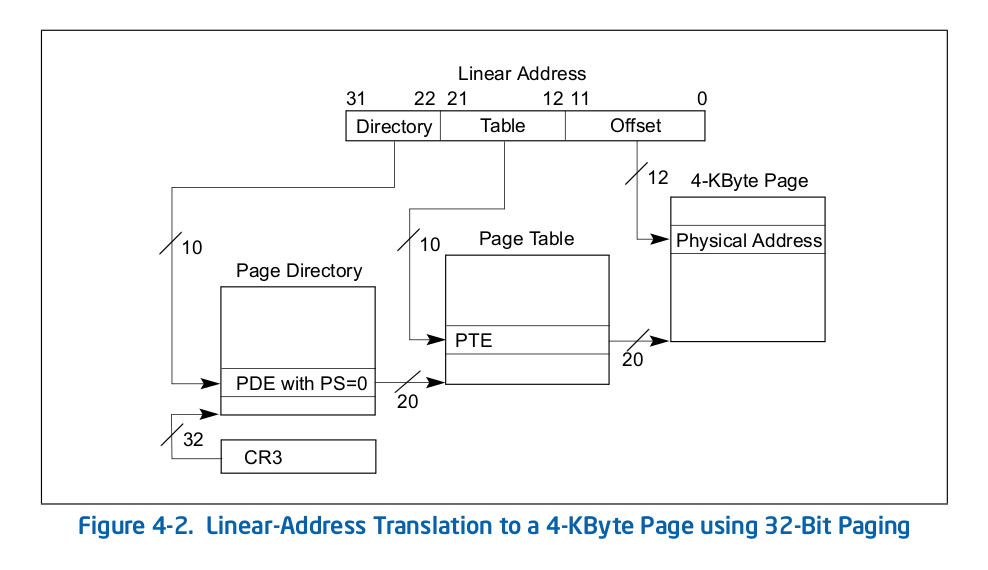

# Structures

# Reference

## Memory Management
[Memory Management Doc](https://www.cs.drexel.edu/~bls96/excerpt4.pdf)
* mm\_kfree: set MM\_HEAPITEM.used to False, then coalesce all free items.
* mm\_kmalloc: use first fit to assign free memory to requrire function

## Segmentation
[Segmentation-TSS](https://en.wikipedia.org/wiki/Task_state_segment)

## DMA
[DMA](https://en.wikipedia.org/wiki/Direct_memory_access)
Using pipe to read bytes from DMA

## Paging
[Paging](./intel_ia32_vol_3abcd.pdf)
For the detail of the structure, page 111

